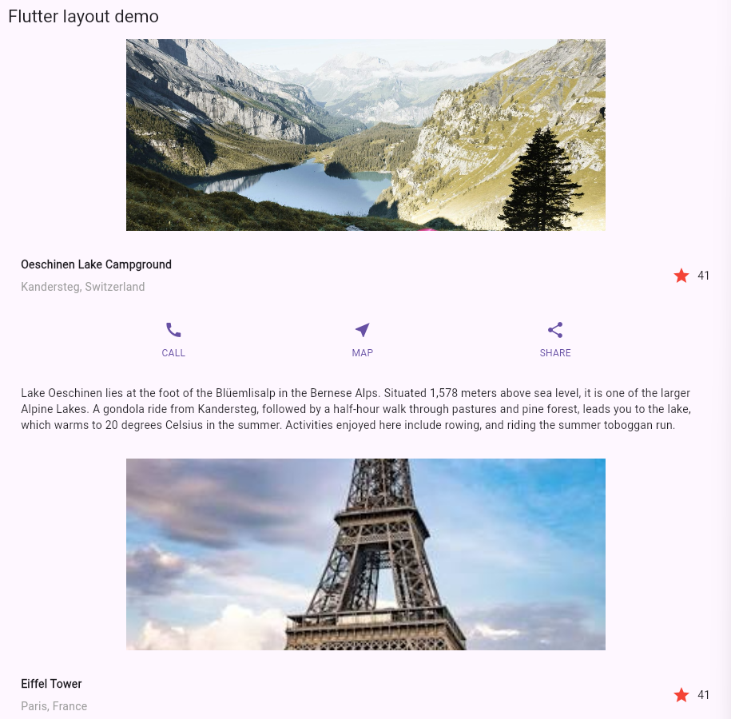
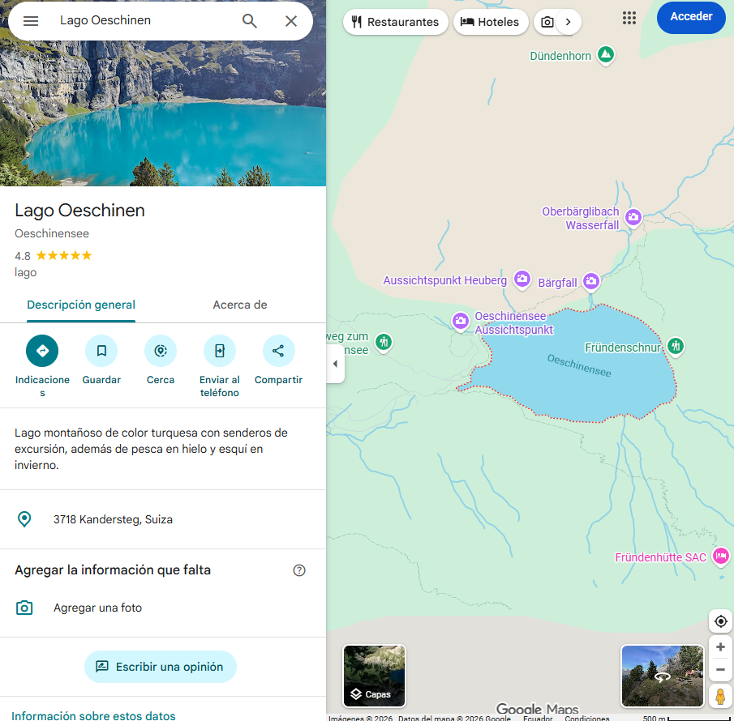

# Flutter Lugares Turísticos 🌍

Aplicación desarrollada en Flutter que muestra una colección de lugares turísticos reconocidos a nivel mundial. Cada lugar incluye una imagen representativa, información descriptiva, un sistema de favoritos y acceso directo a su ubicación en Google Maps.

## 📋 Descripción del proyecto

El proyecto fue desarrollado utilizando Flutter y está basado en una interfaz de desplazamiento vertical (`SingleChildScrollView`) que presenta diferentes destinos turísticos del mundo.

Cada sección incluye:

- Imagen del lugar turístico.
- Nombre y ubicación.
- Descripción informativa.
- Botón de favorito con contador dinámico.
- Botón de acceso a Google Maps para visualizar la ubicación del sitio.

## 🛠️ Tecnologías utilizadas

- Flutter
- Dart
- Material Design
- url_launcher
- Google Maps

## 🚀 Funcionalidades implementadas

### Visualización de lugares turísticos

Se agregaron diferentes destinos turísticos alrededor del mundo, entre ellos:

- Oeschinen Lake Campground (Suiza)
- Eiffel Tower (Francia)
- Great Wall of China (China)
- Machu Picchu (Perú)
- Statue of Liberty (Estados Unidos)
- Colosseum (Italia)
- Christ the Redeemer (Brasil)
- Sydney Opera House (Australia)
- Pyramids of Giza (Egipto)
- Taj Mahal (India)
- Mount Fuji (Japón)

### Sistema de favoritos ⭐

Cada lugar cuenta con un botón de favorito implementado mediante un `StatefulWidget`, permitiendo:

- Agregar un favorito.
- Quitar un favorito.
- Actualizar el contador dinámicamente.

### Integración con Google Maps 📍

Se incorporó la librería `url_launcher` para abrir Google Maps directamente desde la aplicación.

Al presionar el botón **MAP**, el usuario es redirigido automáticamente a la ubicación del sitio turístico seleccionado.

## 📸 Capturas de pantalla

### Pantalla principal de la aplicación



*Figura 1. Vista principal de la aplicación mostrando los lugares turísticos disponibles.*

### Redirección a Google Maps



*Figura 2. Apertura de Google Maps al seleccionar la ubicación de un lugar turístico.*

## 📦 Dependencias utilizadas

```yaml
dependencies:
  flutter:
    sdk: flutter
  cupertino_icons: ^1.0.8
  url_launcher: ^6.3.0
```

## ▶️ Ejecución del proyecto

### Instalar dependencias

```bash
flutter pub get
```

### Ejecutar la aplicación

```bash
flutter run
```

### Generar APK

Modo Debug:

```bash
flutter build apk --debug
```

Modo Release:

```bash
flutter build apk --release
```

## 📂 Estructura general

- `ImageSection`: Muestra imágenes de los destinos turísticos.
- `TitleSection`: Presenta nombre y ubicación.
- `TextSection`: Muestra la descripción del lugar.
- `ButtonSection`: Contiene botones de interacción y acceso a Google Maps.
- `FavoriteWidget`: Gestiona el sistema de favoritos.

## 👨‍💻 Autor

**Nicolás Chiguano**

Escuela Politécnica Nacional
